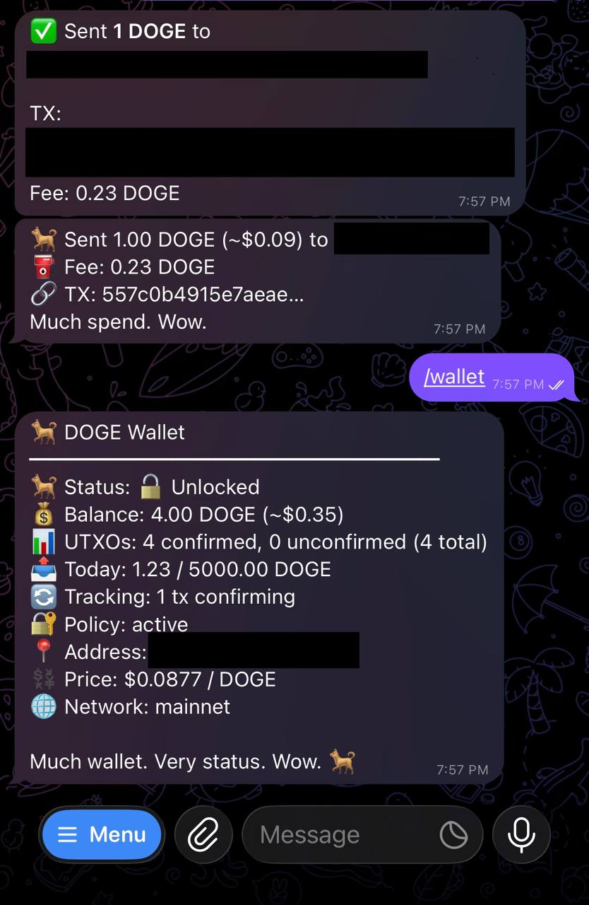

# 🐕 DOGE Wallet Plugin for OpenClaw

A self-custodial Dogecoin wallet that gives OpenClaw agents the ability to hold, send, receive, and manage DOGE autonomously — with owner oversight.

**Much crypto. Very plugin. Wow.**

> 💛 **Like this plugin?** Tips help keep development going: `D6i8TeepmrGztENxdME84d2x5UVjLWncat` (DOGE)



---

## Install

### Option A: From source (recommended)

```bash
# Clone the repository
git clone https://github.com/Quackstro/openclaw-doge-wallet.git

# Move into the OpenClaw extensions directory
mv openclaw-doge-wallet ~/.openclaw/extensions/doge-wallet

# Install dependencies and build
cd ~/.openclaw/extensions/doge-wallet
pnpm install
pnpm build
```

### Option B: From npm (coming soon)

```bash
openclaw plugins install @quackstro/doge-wallet
```

### Restart the gateway

```bash
openclaw gateway restart
```

---

## Features

- **HD Wallet** — BIP-44 derivation, 24-word mnemonic backup
- **Encrypted Keys** — AES-256-GCM encryption at rest with scrypt KDF
- **Hardened File Permissions** — All wallet data auto-secured (700/600) on every startup
- **P2P Broadcasting** — Direct Dogecoin peer-to-peer transaction broadcast (no API dependency)
- **Multi-Provider Failover** — P2P → BlockCypher → SoChain → Blockchair
- **Spending Policy** — Tiered auto-approval, rate limits, daily caps, address allowlist/denylist
- **Agent-to-Agent Payments** — Invoice system with OP_RETURN verification for AI-to-AI transactions
- **Paginated History** — `/history` shows 5 transactions per page with inline buttons (Show More + Search), zero LLM cost
- **Notifications** — Telegram alerts for sends, receives, approvals, low balance
- **Receive Monitor** — Polls for incoming transactions every 5 minutes (configurable, optimized for BlockCypher free tier)
- **Auto-Lock** — Wallet automatically locks after 5 minutes of inactivity (configurable via `security.autoLockMs`)
- **Guided Onboarding** — Step-by-step wallet setup with backup verification via Telegram
- **Security Hardened** — Rate limiting, input sanitization, preflight checks, mnemonic never stored in session history

---

## Quick Start

### 1. Configure the Plugin

Add to your OpenClaw config (`~/.openclaw/openclaw.json`):

```json
{
  "plugins": {
    "entries": {
      "doge-wallet": {
        "enabled": true,
        "config": {
          "network": "mainnet",
          "notifications": {
            "enabled": true,
            "channel": "telegram",
            "target": "YOUR_TELEGRAM_CHAT_ID"
          }
        }
      }
    }
  }
}
```

### 2. Initialize Your Wallet

Send `/wallet` in Telegram. The guided onboarding will:
1. Ask for a passphrase (8+ characters recommended 12+)
2. Show your 24-word recovery phrase — **write it down physically!**
3. Verify you saved it (3-word quiz)
4. Let you set spending limits
5. Give you your DOGE address

### 3. Fund Your Wallet

Send DOGE to your new address. You'll get a Telegram notification when it arrives.

---

## Commands

| Command | Description |
|---------|-------------|
| `/wallet` | Dashboard or start onboarding |
| `/wallet balance` | Check current balance |
| `/wallet send <amount> to <address>` | Send DOGE |
| `/wallet address` | Show receiving address |
| `/wallet history` | Paginated transaction history (5 per page, inline buttons) |
| `/history` | Shortcut for `/wallet history` |
| `/txsearch` | Search transactions by natural language query |
| `/wallet utxos` | UTXO details |
| `/wallet lock` | Lock wallet (clears private key from memory) |
| `/wallet unlock <passphrase>` | Unlock wallet for sending |
| `/wallet freeze` | Emergency stop all sends |
| `/wallet unfreeze` | Resume normal operation |
| `/wallet delete <passphrase>` | Permanently delete wallet (preserves audit logs) |
| `/wallet approve <id>` | Approve a pending transaction |
| `/wallet deny <id>` | Deny a pending transaction |
| `/wallet pending` | Show pending approvals |
| `/wallet invoice <amount> <desc>` | Create A2A invoice |
| `/wallet invoices` | List recent invoices |
| `/wallet help` | Show all commands |

📖 **[Full Command Reference with sample output →](docs/COMMAND-REFERENCE.md)**

---

## Agent Tools

The plugin registers these tools for autonomous agent use:

| Tool | Description |
|------|-------------|
| `wallet_init` | Initialize wallet (mnemonic delivered via DM, never in tool output) |
| `wallet_balance` | Check balance, UTXO count, USD value |
| `wallet_send` | Send DOGE (subject to spending policy) |
| `wallet_history` | Get transaction history |
| `wallet_invoice` | Create A2A payment invoice |
| `wallet_verify_payment` | Verify incoming payment against invoice |
| `wallet_address` | Get current receiving address |

---

## Spending Policy

Transactions are evaluated against configurable tiers:

| Tier | Default Limit | Approval |
|------|---------------|----------|
| Micro | ≤1 DOGE | Auto-approve |
| Small | ≤10 DOGE | Auto-approve (logged) |
| Medium | ≤100 DOGE | Notify + 5-min delay |
| Large | ≤1,000 DOGE | Owner approval required |
| Sweep | >1,000 DOGE | Owner approval + confirmation |

**Rate Limits (default):**
- Daily max: 5,000 DOGE
- Hourly max: 1,000 DOGE
- Max 50 transactions/day
- 30-second cooldown between sends

---

## Transaction Broadcasting

The plugin uses a multi-layer broadcast strategy for maximum reliability:

1. **P2P (primary)** — Direct broadcast to Dogecoin network peers. No API keys, no rate limits.
2. **BlockCypher** — REST API fallback. Optional API token increases rate limit (200 → 2,000 req/hr).
3. **SoChain** — Second API fallback. Requires paid API key.
4. **Blockchair** — Last resort fallback.

P2P connects to 3 random Dogecoin mainnet peers, performs the protocol handshake, and broadcasts `tx` messages directly. No full node required.

---

## Configuration

Full config with defaults:

```json
{
  "network": "mainnet",
  "dataDir": "~/.openclaw/doge",
  "api": {
    "primary": "blockcypher",
    "fallback": "sochain",
    "blockcypher": {
      "apiToken": null
    },
    "sochain": {
      "apiKey": null
    }
  },
  "policy": {
    "enabled": true,
    "tiers": {
      "micro":  { "maxAmount": 1,    "approval": "auto" },
      "small":  { "maxAmount": 10,   "approval": "auto-logged" },
      "medium": { "maxAmount": 100,  "approval": "notify-delay", "delayMinutes": 5 },
      "large":  { "maxAmount": 1000, "approval": "owner-required" },
      "sweep":  { "maxAmount": null, "approval": "owner-confirm-code" }
    },
    "limits": {
      "dailyMax": 5000,
      "hourlyMax": 1000,
      "txCountDailyMax": 50,
      "cooldownSeconds": 10
    },
    "allowlist": [],
    "denylist": []
  },
  "security": {
    "autoLockMs": 300000
  },
  "utxo": {
    "refreshIntervalSeconds": 600,
    "dustThreshold": 100000,
    "consolidationThreshold": 50,
    "minConfirmations": 1
  },
  "notifications": {
    "enabled": true,
    "channel": "telegram",
    "target": "YOUR_TELEGRAM_CHAT_ID",
    "accountId": "main",
    "lowBalanceAlert": 100,
    "dailyLimitWarningPercent": 80
  },
  "api": {
    "priceApi": {
      "provider": "coingecko",
      "cacheTtlSeconds": 300
    }
  },
  "ownerChatIds": ["YOUR_TELEGRAM_CHAT_ID"],
  "fees": {
    "strategy": "medium",
    "maxFeePerKb": 200000000,
    "fallbackFeePerKb": 100000000
  }
}
```

---

## Agent-to-Agent Protocol

AI agents can pay each other using the A2A invoice system:

```text
Agent A creates invoice → Agent B pays to address with OP_RETURN → Agent A verifies on-chain
```

Payments include an `OP_RETURN` output with `OC:<invoiceId>` for trustless on-chain verification.

---

## Quackstro Protocol (QP) — Advanced A2A Economy

The plugin includes the Quackstro Protocol SDK for advanced agent-to-agent economic interactions:

- **HTLC (Hash Time-Locked Contracts)** — Trustless conditional payments with timeout refunds
- **Payment Channels** — 2-of-2 multisig channels for high-frequency micro-transactions
- **Sideload P2P** — Encrypted off-chain messaging between agents
- **Reputation System** — Trust scores and tiered agent reputation
- **Registry** — Agent discovery and capability registration

> ⚠️ QP is currently an SDK-level feature. Direct tool/command integration is planned for a future release.

See `src/qp/README.md` and `src/qp/SPEC.md` for protocol details.

---

## Onboarding Flow

When no wallet exists, `/wallet` triggers a guided step-by-step flow:

1. Welcome screen with **Create Wallet** button
2. Passphrase input (message auto-deleted for security)
3. Mnemonic display (auto-deleted after confirmation)
4. 3-word verification quiz
5. Spending limit configuration
6. Wallet ready!

All inline buttons use the `doge:` callback namespace. During onboarding, a `before_dispatch` hook intercepts user text messages (passphrase, verification answers) to prevent sensitive input from reaching the LLM session.

---

## Security

### Auto-Lock
The wallet automatically locks after a period of inactivity, clearing the private key from memory. This protects against scenarios where you unlock the wallet and forget to lock it manually.

| Option | Default | Description |
|--------|---------|-------------|
| `security.autoLockMs` | `300000` (5 min) | Time in ms before auto-lock. Set to `0` to disable. |

The timer resets on each wallet operation (send, balance check, etc.). When the wallet auto-locks, you'll need to unlock it again before sending.

### API Rate Limits (BlockCypher Free Tier)
The BlockCypher free tier allows ~200 requests/day. The default polling rates are tuned to stay well within this limit:

| Poller | Interval | Requests/Day |
|--------|----------|-------------|
| Receive monitor | 5 min | ~288 |
| UTXO refresh | 10 min | ~144 |

With both active, you'll use ~288 + 144 = ~432 requests/day if running 24/7. Since receive monitoring only polls when the wallet is active, actual usage is typically well under the limit. If you have a BlockCypher API token, the limit increases to 2,000 req/hr.

### Key Storage
- Private keys encrypted with AES-256-GCM + scrypt KDF (N=131072, r=8, p=1)
- Keystore file: `0600` (owner read/write only)
- Keys directory: `0700` (owner only)
- **All data files auto-hardened** on every startup — no manual chmod needed
- Private key zeroed from memory on lock
- Mnemonic delivered via secure Telegram DM, never stored in agent session history

### File Permissions (automatic)
Every file write uses `secureWriteFile` which enforces `0600` + explicit `chmod` to bypass umask. Every directory uses `secureMkdir` with `0700`. The plugin runs `ensureSecureDataDir` on every startup to harden existing installs.

### Rate Limiting
- Per-tool rate limits with sliding window
- Adaptive backoff on API rate limit responses
- Cooldown between transactions

### Emergency
If you suspect compromise:
1. `/wallet freeze` — stops all outbound transactions immediately
2. Sweep funds to a secure external wallet
3. Rotate to a new wallet if needed

---

## File Structure

```
~/.openclaw/doge/          (700)
├── keys/                  (700)
│   └── wallet.json        (600) — encrypted keystore
├── audit/                 (700)
│   └── audit.jsonl        (600) — transaction audit trail
├── utxo/                  (700)
├── utxos.json             (600) — cached UTXO set
├── tracking.json          (600) — pending tx tracker
├── limits.json            (600) — daily/hourly spend tracking
├── receive-state.json     (600) — receive monitor state
├── alert-state.json       (600) — notification state
└── rate-limit-state.json  (600) — rate limiter persistence
```

---

## Requirements

- **Node.js** ≥ 20.0.0
- **OpenClaw** with Telegram channel configured (for notifications + onboarding)
- No Dogecoin node required (P2P + API providers handle everything)

---

## Roadmap

### ✅ Completed (v0.1.0)

- [x] HD wallet with BIP-44 derivation
- [x] AES-256-GCM encrypted keystore
- [x] Multi-provider API failover (BlockCypher, SoChain, Blockchair)
- [x] P2P transaction broadcasting
- [x] Tiered spending policy with owner approval
- [x] Telegram notifications + guided onboarding
- [x] Agent-to-Agent invoice system with OP_RETURN verification
- [x] UTXO management + consolidation recommendations
- [x] Rate limiting + security hardening
- [x] Quackstro Protocol SDK (HTLC, payment channels, sideload P2P, reputation)

### 🚧 In Progress

- [ ] **Local Node Support** — Connect to your own Dogecoin Core node (pruned or full) instead of third-party APIs. Eliminates rate limits, improves privacy, and adds reliability. [See plan →](docs/PLAN-local-node-support.md)
- [ ] **QP Tool Integration** — Expose HTLC and payment channel operations as agent tools

### 📋 Planned

- [ ] **Electrum Server Support** — Lighter alternative to full node (ElectrumX/Fulcrum)
- [ ] **Multi-Address HD Rotation** — Fresh receive address per transaction for privacy
- [ ] **QR Code Generation** — Display receive address as QR in Telegram
- [ ] **Fiat On-Ramp Integration** — Buy DOGE directly through the wallet
- [ ] **Hardware Wallet Support** — Sign transactions with Ledger/Trezor
- [ ] **Multi-Wallet Mode** — Manage multiple wallets per agent

### 💡 Considering

- [ ] Stealth addresses for enhanced privacy
- [ ] CoinJoin integration
- [ ] Lightning-style atomic swaps (DOGE ↔ other chains)
- [ ] Scheduled/recurring payments
- [ ] Webhook callbacks for external integrations

Have a feature request? Open an issue or drop a tip with a memo! 🐕

---

## License

MIT — Built by [Quackstro LLC](https://quackstro.com)

---

## Support the Project

If you find this plugin useful, tips are always appreciated:

**DOGE Address:** `D6i8TeepmrGztENxdME84d2x5UVjLWncat`

Every DOGE goes toward hosting, continued development, and keeping the lights on. 🐕

---

*Much wallet. Very secure. Such DOGE. Wow.* 🐕
